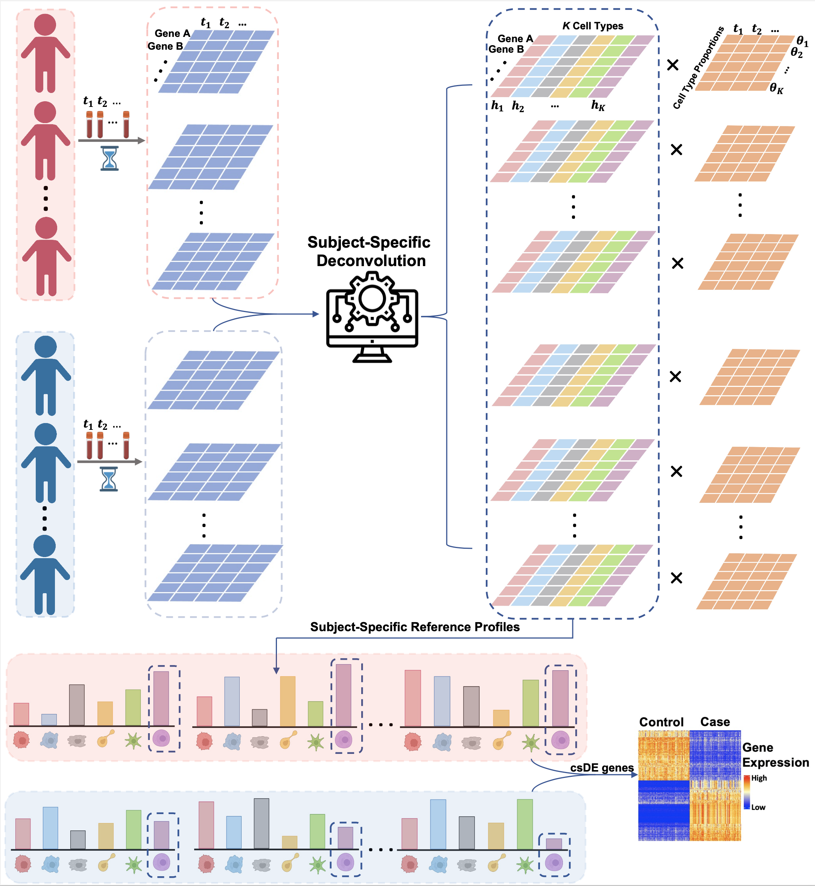

```{r, echo=FALSE}
htmltools::img(src = knitr::image_uri("islet_hex_2.png"), 
               alt = 'logo', 
               style = 'position:absolute; top:0; left:0; padding:10px; height:280px')
```

# Install and help

## Install ISLET

To install the package, start R (version 4.2.0 or higher) and enter:

```{r, eval = FALSE, message = FALSE}
if (!require("BiocManager", quietly = TRUE))
    install.packages("BiocManager")

BiocManager::install("ISLET")
```

## How to get help

You may post your question on ISLET's GitHub Issue section: <https://github.com/haoharryfeng/ISLET/issues>.

# Introduction

In clinical samples, the observed bulk sequencing/microarray data are often a mixture of different cell types. Because each unique cell type has its own gene expression profile, the real sequencing/microarray data are the weighted average of signals from multiple pure cell types. In high-throughput data analysis, the mixing proportions will confound with the primary phenotype-of-interest, if not properly accounted for. Over the past several years, researchers have gained substantial interests in using computational methods to deconvolute cell compositions. Under the assumption of a commonly shared feature-by-cell-type reference panel across all samples, deconvolution methods were developed. However, this assumption may not hold. For example, when repeated samples are measured for each subject, assuming a shared reference panel across different time points for each subject is a preferred choice over assuming a shared one across all the samples.

Here, we developed a method called `ISLET` (Individual-Specific ceLl typE referencing Tool), to solve for the individual-specific and cell-type-specific reference panels, once the cell type proportions are given. `ISLET` can leverage on multiple observations or temporal measurements of the same subject. `ISLET` adopted a more reasonable assumption that repeated samples from the same subject would share the same reference panel. This unknown **subject-specific** panel, treated as missing values, are modeled by Gaussian distribution in the mixed-effect regression framework and estimated by an iterative Expectation--Maximization (EM) algorithm, when combining all samples from all subjects together. This is the first statistical framework to estimate the subject-level cell-type-specific reference panel, for repeated measures. Our modeling can effectively borrow information across samples within the same subject. `ISLET` can deconvolve reference panels based on the raw counts without batch effect in library size or the normalized counts such as Transcript Per Million (TPM). In the current version, `ISLET` performs cell-type-specific differential expression analysis for two groups of subjects. Other covariates and additional groups will be added in future versions.



`ISLET` depends on the following packages:

-   `r Biocpkg("BiocParallel")`, for parallel computing implementation,
-   `r CRANpkg("Matrix")`, for large matrices operations in *R*,
-   `r Biocpkg("SummarizedExperiment")`, to store rectangular matrices of experimental results.

# ISLET input files

ISLET needs one input file organized into `r Biocpkg("SummarizedExperiment")` objects, combining cases and controls. The input file should contain a feature by sample matrix for observed values stored in the `counts` slot. It should also use the first column in `colData` slot to store the group status (i.e. case/control), the second column in the `colData` slot to store the subject IDs mapping to each sample. The remaining columns in the `colData` slot should store the cell type proportions. In other words, use the column 3 to K+2 to store the cell type proportions for all K cell types. An example dataset `GE600` is included:

**Step 1**: Load in example data.

```{r, eval = TRUE, message = FALSE}
library(ISLET)
data(GE600)
ls()
GE600_se
```


It contains a `SummarizedExperiment` object containing the following elements:

`counts` stores the gene expression value data frame of 10 genes by 520 sample, with 83 cases and 89 controls, and multiple repeated measurements (i.e. time points) per subject. Each row is a gene and each column is a sample. 
```{r, eval = TRUE, message = FALSE}
assays(GE600_se)$counts[1:5, 1:6]
```

`colData` stores the sample meta-data and the input cell type proportions. The first column is the group status (i.e. case/ctrl), the second column is the subject ID, shows the relationship between the 520 samples IDs and their 172 subject IDs. The remaining 6 columns (i.e. column 3-8) are the cell type proportions of all samples by their 6 cell types. The 6 cell types are: B cells, Tcells_CD4, Tcells_CD8, NK cells, Mono cells, and others cells.
```{r, eval = TRUE, message = FALSE}
colData(GE600_se)
```


# Data preparation

This is the first step required before using ISLET for individual-specific reference deconvolution or testing. This step will prepare your input data for the downstream reference panels deconvolution (function `isletSolve`) and/or testing of differential expression gene (function `isletTest`). During this step, the input data in `SummarizedExperiment` format will be further processed for ISLET. The expression values, from cases and controls respectively, will be extracted. The cell type names, number of cell types, number of cases/controls subject, number of cases/controls samples, will be obtained.  

**Step 2**: Data preparation for downstream ISLET analysis.

```{r, eval = TRUE, message = FALSE}
study123input <- dataPrep(dat_se=GE600_se)
```

The output, are the extracted information in a S4 object, and can be overviewed by the function below:

```{r, eval = TRUE, message = FALSE}
study123input
```

[**Attention**] Here we have strict requirement for the input data. Each subject ID represents a unique participant across cases and controls. Subjects also need to be sorted. 

# Deconvolve individual-specific reference panel

**Step 3**: With the curated data `study123input` from the previous step, now we can use `ISLET` to conduct deconvolution and obtain the individual-specific and cell-type-specific reference panels. This process can be achieved by running:

```{r, eval = TRUE, message = FALSE}
#Use ISLET for deconvolution
res.sol <- isletSolve(input=study123input)
```

The `res.sol` is the deconvolution result list. For both case and control group, the deconvolution result is a list of length `K`, where `K` is the number of cell types. For each of the `K` elements, it is a matrix of dimension `G` by `N`. For each of the `K` cell types, it stores the deconvoluted values in a feature (`G`) by subject (`N`) matrix,

```{r, eval = TRUE, message = FALSE}
#View the deconvolution results
caseVal <- caseEst(res.sol)
ctrlVal <- ctrlEst(res.sol)
length(caseVal) #For cases, a list of 6 cell types' matrices. 
length(ctrlVal) #For controls, a list of 6 cell types' matrices.
caseVal$Bcells[1:5, 1:4] #view the reference panels for B cells, for the first 5 genes and first 4 subjects, in Case group.
ctrlVal$Bcells[1:5, 1:4] #view the reference panels for B cells, for the first 5 genes and first 4 subjects, in Control group.
```

`case.ind.ref` A list of length `K`, where `K` is the number of cell types. For each of the `K` elements in this list, it is a feature by subject matrix containing all the feature values (i.e. gene expression values), for case group. It is one of the main products the individual-specific and cell-type-specific solve algorithm. `ctrl.ind.ref` A list of length `K`, where `K` is the number of cell types. For each of the `K` elements in this list, it is a feature by subject matrix containing all the feature values (i.e., gene expression values), for control group. It is one of the main products the individual-specific and cell-type-specific solve algorithm. `mLLK` A scalar, the optimized marginal log-likelihood for the current model. It will be used in Likelihood Ratio Test (LRT).

# Test cell-type-specific differential expression (csDE) in mean (intercept)

Also, with the curated data `study123input` from the previous **Step 2**, now we can test the group effect on individual reference panels, i.e., identifying csDE genes in mean or intercept. In this 'intercept test', we assume that the individual-specific reference panel is unchanged across time points. Note that **Step 3** can be skipped, if one only need to call csDE genes. This test is done by the following line of code:

```{r, eval = TRUE, message = FALSE}
#Test for csDE genes
res.test <- isletTest(input=study123input)
```

The result `res.test` is a matrix of p-values, in the dimension of feature by cell type. Each element is the LRT p-value, by contrasting case group and control group, for one feature in one cell type.

```{r, eval = TRUE, message = FALSE}
#View the test p-values
head(res.test)
```


# Test csDE in change-rate (slope)

Given an additional continuous variable such as time or age, ISLET is able to compare cases and controls in the change-rate of reference profile over time. This is the 'slope test'. Here, the assumption is that for the participants or subjects in a group, the individual reference profile could change over time, with change-rate fixed by group. At a given time point, there may be no (significant) group effect in the reference panel, but the participants still have distinct underlying reference profiles. Under this setting, it is of interest to test for such difference. Below is an example to detect reference panel change-rate difference between two groups, from data preparation to test.

We provide an additional example dataset `GE600age` from the initial step to illustrate this. Different from the dataset `GE600` above, here `GE600age` has an additional `age` column in the `colData`, besides subject ID and cell type proportions. This covariate `age` is required for the test.

**Step 1**: Load example dataset.

```{r, eval = TRUE, message = FALSE}
#(1) Example dataset for 'slope' test
data(GE600age)
ls()
```

Similar to previous sections, it contains one `SummarizedExperiment` objects containing the following elements:

`counts` has the gene expression value data frame of 10 genes by 520 sample, with 83 cases and 89 controls, and multiple repeated measurements (i.e. time points) per subject. Each row is a gene and each column is a sample. 
```{r, eval = TRUE, message = FALSE}
assays(GE600age_se)$counts[1:5, 1:6]
```

`colData` contains the sample meta-data. The first column is the case/ctrl group status, the second column is the subject ID, shows the relationship between the samples IDs and the corresopnding subject IDs. The third column is the age variable for each sample, which is the main variable in downstream testing. The remaining 6 columns (i.e. column 4-9) are the cell type proportions of all samples by their 6 cell types. The 6 cell types are: B cells, Tcells_CD4, Tcells_CD8, NK cells, Mono cells, and others cells.
```{r, eval = TRUE, message = FALSE}
colData(GE600age_se)
```


[**Attention**] This time/age covariate must be stored in the third column in `colData`, to successfully execute this testing. The data must be sorted by subject ID, so that the multiple replicates per subject are close to each other. 

**Step 2**: Data preparation.

```{r, eval = TRUE}
#(2) Data preparation
study456input <- dataPrepSlope(dat_se=GE600age_se)
```

**Step 3**: 'Slope' testing.

```{r, eval = TRUE}
#(3) Test for slope effect(i.e. age) difference in csDE testing
age.test <- isletTest(input=study456input)
```

The result `age.test` is a matrix of p-values, in the dimension of feature by cell type. Each element is the LRT p-value, by contrasting case group and control group, for one feature in one cell type. In contrast to the (intercept) test described before, here is a test for difference of the expression CHANGE IN REFERENCE over time, between cases and controls.

```{r, eval = TRUE, message = FALSE}
#View the test p-values
head(age.test)
```

# ***imply***: improving cell-type deconvolution accuracy using personalized reference profiles

To use imply to improve cell proportions by incorporating subject-specific and cell-type-specific (personalized) reference panels, you need to start with an input file organized into `SummarizedExperiment` objects, as previously described for ISLET. In this example, we will use the `GE600` dataset for illustration.

This initial step is crucial to prepare your input data for the downstream cell deconvolution using the `implyDataPrep` function. During this preparation step, the data in `SummarizedExperiment` format will undergo the following processing:

- Extraction of expression values from both cases and controls.
- Extraction of the initial cell proportions, preferably obtained from CIBERSORT.
- Determination of the total number of cell types.
- Extraction of the total number of subjects for case and control, respectively.
- Determination of the total number of samples.

By executing this preparation step, your data will be in the ideal format for subsequent personalized deconvolution with `imply`. 

```{r, eval = TRUE, message = FALSE}
dat123 <- implyDataPrep(sim_se=GE600_se)
```

The output of this preparation step is an S4 object containing the extracted information. You can easily review this object to ensure that your data is correctly prepared.

```{r, eval = TRUE, message = FALSE}
dat123
```

With the curated input `dat123` from the previous step, now we can use `imply` to conduct personalized cell deconvolution to obtain the improved cell proportions. This process can be achieved by running:

```{r, eval = TRUE, message = FALSE}
#Use imply for deconvolution
result <- imply(dat123)
```

The `result` is a list of deconvolution results returned by `imply`, which includes two elements: `p.ref` and `imply.prop`. `p.ref` is the estimated personalized reference panels. It is an array of dimension \emph{G} by \emph{K} by \emph{N}, where \emph{G} is the total number of genetic features, \emph{K} is the total number of cell types, and \emph{N} is the total number of subjects. `imply.prop` is the updated cell proportion results improved by personalized reference panels from \code{p.ref}. It is a `data.frame` of \emph{T} by \emph{K}, where \emph{T} is the total number of samples across all subjects.

The outputs and can be extracted as shown below:
```{r, eval = TRUE, message = FALSE}
#View the subject-specific and cell-type-specific reference panels solved 
#by linear mixed-effect models of the first subject
result$p.ref[,,1]
```

```{r, eval = TRUE, message = FALSE}
#View the improved cell deconvolution results
head(result$imply.prop)
tail(result$imply.prop)
```

# Session info {.unnumbered}

```{r sessionInfo, echo=FALSE}
sessionInfo()
```
